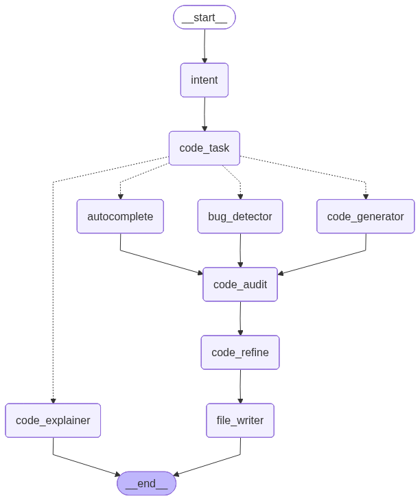

# CodeMind — AI Code Intelligence Platform

> A full-stack AI coding assistant powered by a multi-node LangGraph pipeline, dual-source RAG retrieval with AST-aware chunking, and custom fine-tuned models trained specifically for safe code generation, intelligent autocomplete, and professional code refinement.

---

## Demo

> 📹 **[Watch Demo Video](src/docs/demo.mp4)**

---

## What Makes This Project Stand Out

### 1. Custom Fine-Tuned Models for Key Pipeline Nodes

Most AI coding assistants rely entirely on generic pre-trained models. CodeMind goes further — **three critical nodes in the pipeline are powered by custom fine-tuned models**, each trained for a specific task:

| Node | Fine-Tuning Method | Purpose | Training Notebook |
|------|-------------------|---------|-------------------|
| **Code Generation** | DPO (Direct Preference Optimization) | Trains the model to actively prefer safe outputs over unsafe ones, ensuring generated code is non-harmful by design | [View on Kaggle](https://www.kaggle.com/code/abdelrhmansaadidrees/code-generation) |
| **Autocomplete** | Fill-in-the-Middle (FIM) | Trains the model to predict masked middle sections of code, enabling accurate in-context completions rather than simple next-token prediction | [View on Kaggle](https://www.kaggle.com/code/abdelrhmansaadidrees/autocompleteion) |
| **Code Refining** | Supervised Fine-Tuning (SFT) | Teaches the model to add professional docstrings and inline comments matching real library patterns, without altering functionality | [View on Kaggle](https://www.kaggle.com/code/abdelrhmansaadidrees/code-refining) |

Users can run the entire pipeline with **OpenAI** (plug-and-play) or swap these three nodes to use the **custom HuggingFace models**.

---

### 2. Dual-Source RAG: Project Context + Codebase Reference

Every LLM call in CodeMind is grounded in two independent retrieval sources, giving the model real context rather than hallucinated assumptions.

#### Project RAG — The User's Own Codebase

When a user uploads their project as a `.rar` archive, CodeMind extracts, chunks, embeds, and indexes all source files into a **dedicated per-project ChromaDB collection**. Before any LLM call, relevant chunks are retrieved using cosine similarity and injected directly into the prompt.

This means the model knows about:
- The user's own helper functions and class definitions
- Their naming conventions, import structure, and coding style
- How project-internal dependencies relate to each other

The result is that generated, completed, or explained code is consistent with what the user has already written — not generic boilerplate.

#### Codebase RAG — Curated Real-World Repository References

A separate shared ChromaDB collection is built by cloning and indexing curated, high-quality open-source Python repositories:

| Repository | What It Teaches the Model |
|-----------|--------------------------|
| **FastAPI** | Routing patterns, dependency injection, middleware |
| **LangChain** | Chains, agents, memory, tools |
| **LangGraph** | Stateful multi-agent graph execution |
| **ChromaDB** | Vector store client and server patterns |

This reference DB is queried at generation, autocomplete, and refine nodes. It gives the model real idiomatic examples from production-grade libraries, improving the quality and correctness of any code involving these tools — without inventing patterns that don't exist.

---

### 3. Python AST-Aware Chunker

The quality of RAG retrieval depends entirely on the quality of the chunks. Most systems use naive character or token windows that cut through the middle of functions and break semantic units. CodeMind uses a **custom Python AST-aware chunker** that parses source files into their actual logical structure.

**How it works:**

The chunker walks the top-level AST of every `.py` file and creates one chunk per semantic unit:

```
source file
    ├── imports block          → one "imports" chunk
    ├── def my_function():     → one "function" chunk
    ├── class MyClass:         → one "class" chunk (including all methods)
    └── module-level code      → one "module" chunk
```

**Why this matters over naive chunking:**

A naive character-window chunker might split a 40-line function at line 20, giving the retriever two useless half-functions. The AST chunker guarantees that every chunk is a **complete, self-contained unit of code** — a full function signature with its body, a full class with all its methods, or a full import block. When the LLM receives retrieved chunks as context, each one is immediately usable and semantically meaningful.

For non-Python files (configs, markdown, YAML), the chunker falls back to a sliding-window character split with overlap, ensuring nothing is lost.

---

## Pipeline Workflow



```
User Input
    │
    ▼
[Intent Node]          — Classifies: generate | autocomplete | explain | bug_detection | refactor
    │
    ▼
[Code Task Node]       — Extracts the structured task and any code snippet from the prompt
    │
    ├──► [Code Generator Node] ◄── DPO fine-tuned · Project RAG + Codebase RAG
    ├──► [Autocomplete Node]   ◄── FIM fine-tuned  · Project RAG + Codebase RAG (functions only)
    ├──► [Bug Detector Node]                       · Project RAG
    └──► [Code Explainer Node]                     · Project RAG  ──► END
              │
              ▼
         [Code Audit Node]    — Scans for injections, hardcoded secrets, unsafe patterns
              │
              ▼
         [Code Refine Node]   ◄── SFT fine-tuned   · Codebase RAG (docstring style)
              │
              ▼
         [File Writer Node]   — LLM decides single vs multi-file split, writes to disk
              │
              ▼
         Final Response
```

---

## Features

- **Code Generation** — Safe, production-ready Python code from a plain description
- **Autocomplete** — Accurate in-context completion of partial snippets
- **Bug Detection** — Identifies and fixes logical and syntax errors using project context
- **Code Explanation** — Step-by-step explanation with awareness of the user's own helpers
- **Security Audit** — Detects SQL injection, XSS, hardcoded credentials, and unsafe patterns
- **Code Refactoring** — Adds docstrings and comments styled after real library conventions
- **Project Upload** — Upload a `.rar` archive; full codebase is indexed into a private vector store
- **Codebase Reference DB** — Curated open-source repos indexed as an idiomatic pattern library
- **File Writer** — Output is intelligently split into one or multiple files and written to disk
- **Full React UI** — Syntax-highlighted chat interface, session history, drag-and-drop upload

---

## Tech Stack

| Layer | Technology |
|-------|-----------|
| Proxy Server | Node.js, Express, Multer |
| Backend | Python, FastAPI, LangGraph, LangChain |
| LLM Providers | OpenAI API / HuggingFace Transformers |
| Vector Store | ChromaDB (persistent, isolated per-project collections) |
| Embeddings | `text-embedding-3-small` (1536-dim, cosine similarity) |
| Code Chunking | Python AST-aware chunker + sliding-window fallback |

---

## Custom HuggingFace Models

| Model | HuggingFace Link |
|-------|-----------------|
| Code Generation (DPO) | [AbdoSaad24/deepseek-coder-6.7b-security-dpo](https://huggingface.co/AbdoSaad24/deepseek-coder-6.7b-security-dpo) |
| Autocomplete (FIM) | [AbdoSaad24/fim_deepseek-coder-6.7b-code-autoCompletion-finetuned](https://huggingface.co/AbdoSaad24/fim_deepseek-coder-6.7b-code-autoCompletion-finetuned) |
| Code Refine (SFT) | [AbdoSaad24/deepseek-coder-6.7b-code-gen-finetuned](https://huggingface.co/AbdoSaad24/deepseek-coder-6.7b-code-gen-finetuned) |
---

## Getting Started

### Prerequisites

- Python 3.10+
- Node.js 18+
- `unrar` on the system

```bash
sudo apt update && sudo apt install unrar
```

### 1. Backend

```bash
cd src
cp ../.env.example .env
pip install -r requirements.txt
uvicorn main:app --reload --host 0.0.0.0 --port 8000
```

### 2. Proxy Server

```bash
cd codemind/server
cp .env.example .env
npm install && npm run dev
```

### 3. Frontend

```bash
cd codemind/client
npm install && npm run dev
# Opens at http://localhost:5173
```

### One-Command Start

```bash
cd codemind
npm run install:all
npm run dev
```

---

## Configuration

```env
# "openai" uses OpenAI for all nodes
# "huggingface" uses custom fine-tuned models for generation, autocomplete, and refine
PROVIDERS=openai  # openai | huggingface

HF_Generation_MODEL_ID=AbdoSaad24/deepseek-coder-6.7b-security-dpo
HF_Autocomplete_MODEL_ID=AbdoSaad24/fim_deepseek-coder-6.7b-code-autoCompletion-finetuned
HF_Refine_MODEL_ID=AbdoSaad24/deepseek-coder-6.7b-code-gen-finetuned

OPENAI_API_KEY=your_api_key_here
OPENAI_API_URL=your_api_url_here
OPENAI_MODEL_ID=your_model_id_here
```

---

## Indexing the Codebase Reference DB

Run once after starting the backend to clone and index all curated repos:

```bash
curl -X POST http://localhost:8000/api/v1/codebase/index

# Check status
curl http://localhost:8000/api/v1/codebase/status
```

---

## Project Structure

```
├── src/                        # FastAPI backend
│   ├── main.py
│   ├── routes/
│   ├── models/
│   │   └── QuickTasks/
│   │       ├── Graphs/         # LangGraph pipeline
│   │       ├── nodes/          # One file per pipeline node
│   │       ├── prompts/        # Structured prompts per node
│   │       └── states/         # Pydantic state models
│   ├── controllers/            # Upload and file management
│   └── stores/
│       ├── llm/                # OpenAI + HuggingFace providers
│       ├── vectorDB/           # EmbeddingService + AST chunker
│       └── CodeBaseVDB/        # Codebase reference indexer
│
└── codemind/                   # Full-stack UI
    ├── client/                 # React + Vite frontend
    └── server/                 # Node.js proxy
```

---
